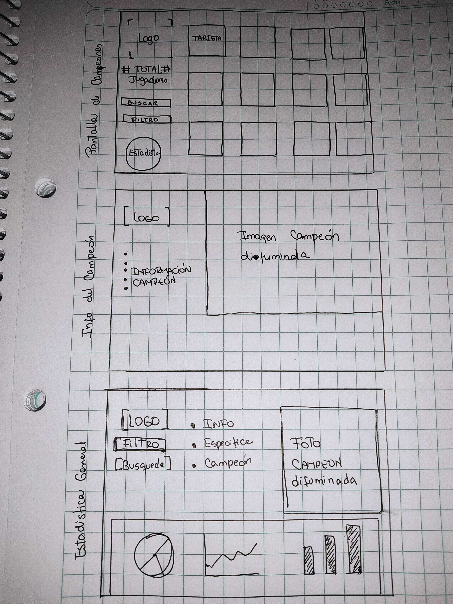

## HISTORIAS DE USUARIO

### JUGADOR PRINCIPIANTE
#### LO QUE NECESITA: Visualizar información básica sobre el juego y sus personajes
#### PARA: Conocer sobre LOL antes de empezar a jugarlo
#### CRITERIOS DE ACEPTACIÓN:
    - Pestaña con información básica del juego (Qué es, cómo se juega).
    - Organizar de forma concisa la información
    - Que se visualice en diferentes dispositivos
    - Link de enlace para galería de campeones

###  LOL JUGADOR DE OTROS JUEGOS Y QUE ESTA INTERESADO APRENDER LOL
#### LO QUE NECESITA: Una manera de clasificar a los personajes, filtrar los rol, poder y dificultad.
#### PARA: Familiarizarme con las mecánicas de juego en base a mis conocimientos previos. 
#### CRITERIOS DE ACEPTACIÓN:
    - Visualización de galeria de campeones con sus nombres
    - Botón o checkbox para filtrar campeones basado en su rol, poder y dificultad
    - Función para buscar campeones

### JUGADOR EXPERIMIENTADO DE LOL
#### LO QUE NECESITA: Filtrar los campeones en base a sus STATS.
#### PARA: Comparar campeones en base a sus niveles de ataque, defensa, maná, etc, para diferenciar a los mejores del grupo.
#### CRITERIOS DE ACEPTACIÓN: 
    - Filtro de cálculos en base a STATS
    - Desplegar información del campeón y visualizar sus estadisticas

## CÓMO LO LOGRAMOS
- Desarrollamos prototipos de baja fidelidad 

|

|||

#### Link de Figma https://www.figma.com/file/GSzj91U0eyLOuyddXMN71k/Untitled?node-id=13%3A1
